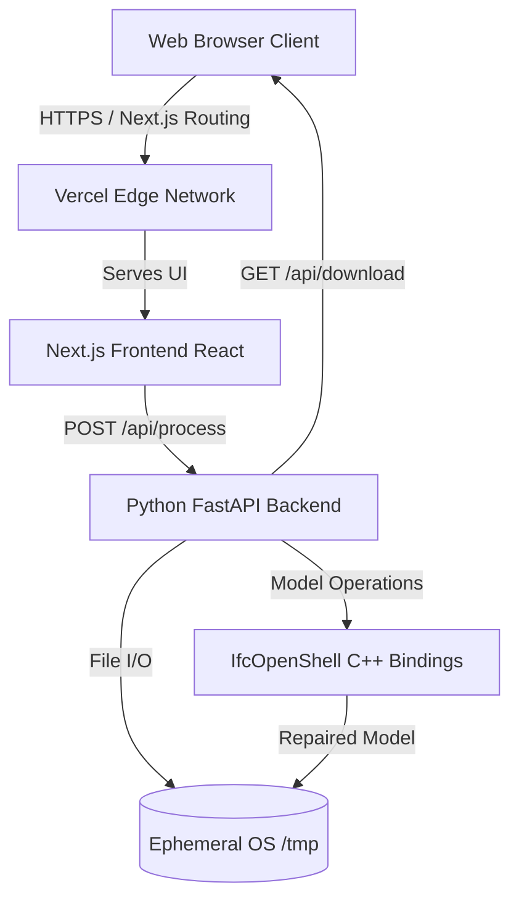
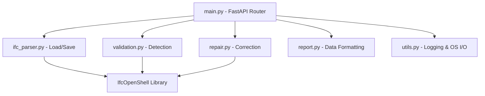
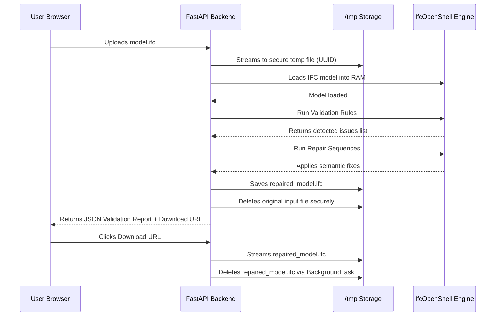
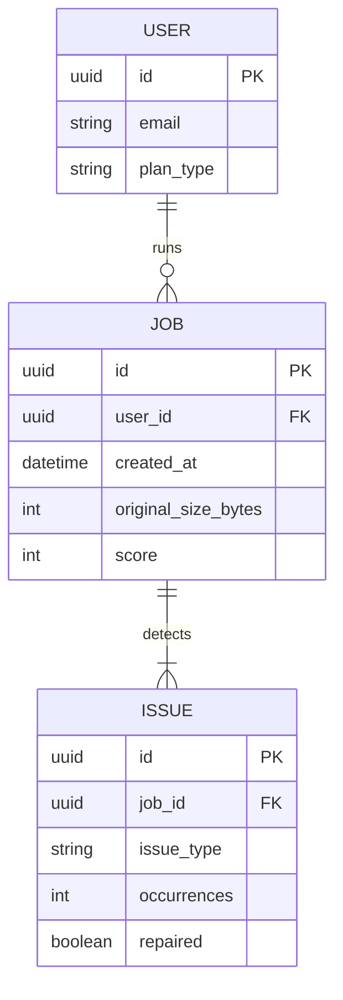

# System Architecture

## 1. Project Architecture

The IFC Repair SaaS is structured as a decoupled application with a React-based frontend and a Python-based processing engine.

---

## 2. Backend Module Dependencies

The backend is strictly modular. The main application router simply orchestrates distinct services for parsing, validating, repairing, and reporting.

---

## 3. Data Flow Diagram

---

## 4. Database Architecture

Currently, the application runs entirely **Statelessly**. It operates as a strict utility API that adheres to strict zero-retention privacy policies. User files are deleted within seconds or minutes. 

### Future Database Architecture (Planned)
If user accounts, billing, and historic job tracking are implemented, a relational database (e.g., PostgreSQL) is recommended.

---

## 5. Deployment Architecture

### Scenario A: Vercel Only (Monorepo)
Both the Next.js frontend and the Python backend are hosted entirely within the Vercel ecosystem using Serverless Functions.

- **Frontend**: Standard Vercel Edge caching and static hosting.
- **Backend**: The `api/index.py` file serves as a wrapper to deploy the FastAPI application on AWS Lambda via Vercel's Serverless Python runtimes. Memory limits are constrained (up to 1024MB default), making it suitable for small-to-medium IFC files.

### Scenario B: Vercel + Google Cloud Run (Recommended for Heavy Processing)
To process massive IFC files (100MB+), the backend must be detached from serverless constraints and run inside a container.

- **Frontend**: Remains on Vercel.
- **Backend**: Containerized using the provided `Dockerfile` and deployed to Google Cloud Run, Railway, or AWS Fargate. 
- **Networking**: The Next.js frontend utilizes the `NEXT_PUBLIC_API_URL` environment variable to transparently direct uploads to the dedicated GPU/CPU Cloud Run container instead of the Vercel internal API.
